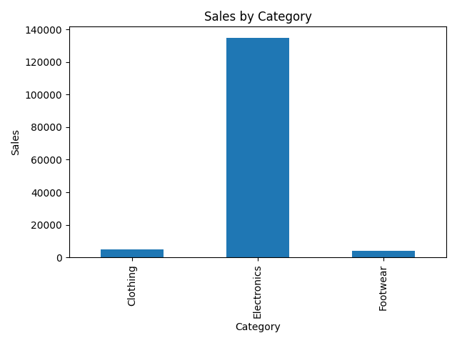
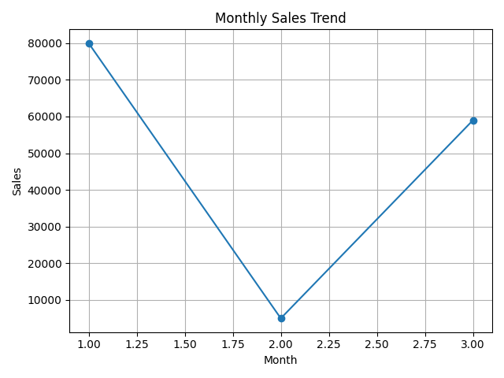

# DataAnalysis-task5
# Sales Data Analysis Using Pandas

## Objective
Analyze sales data from a CSV file using Python and Pandas.

## Tools Used
- Python
- Pandas
- Matplotlib
- Jupyter Notebook

## Features
- Load CSV data
- Data cleaning
- Sales analysis
- Category-wise sales summary
- Monthly sales trends
- Data visualization

## Output

### Category Sales Chart

### Monthly Sales Trend

